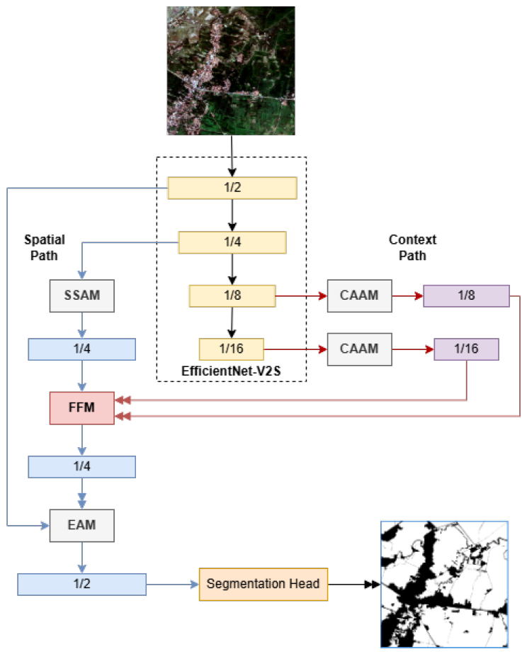

# TerraSegNet



## Overview
**TerraSegNet** is a novel semantic segmentation model designed for remote sensing applications.  
The architecture integrates convolutional neural networks with attention-based modules to effectively capture both spatial and contextual information from multi-source satellite imagery.  

## Features
- Dual-path design combining spatial and contextual feature learning.
- Attention-enhanced modules for better long-range dependency modeling.
- Optimized for multi-source and multi-resolution satellite datasets.
- Achieves state-of-the-art performance on various benchmark datasets.

## Datasets
The datasets used in this study are publicly available:

- **SPARCS dataset**: [https://emapr.ceoas.oregonstate.edu/sparcs/](https://emapr.ceoas.oregonstate.edu/sparcs/)  
- **WHUS2-CD+ dataset**: [https://doi.org/10.5281/zenodo.5511792](https://doi.org/10.5281/zenodo.5511792)  
- **PV08 dataset**: [https://doi.org/10.5281/zenodo.5171711](https://doi.org/10.5281/zenodo.5171711)  
- **Plot-Rice v1.0 dataset**: [https://doi.org/10.5281/zenodo.13897215](https://doi.org/10.5281/zenodo.13897215)  
- **AIR-PolSAR-Seg-2.0 dataset**: [https://doi.org/10.57760/sciencedb.radars.00041](https://doi.org/10.57760/sciencedb.radars.00041)  

## Getting Started
### Requirements
- Python 3.8+
- PyTorch >= 1.11
- Torchvision >= 0.12
- Other dependencies listed in `requirements.txt`

### Installation
Clone the repository:
```bash
git clone https://github.com/your-username/TerraSegNet.git
cd TerraSegNet
pip install -r requirements.txt
